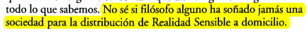
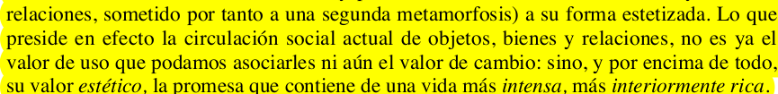
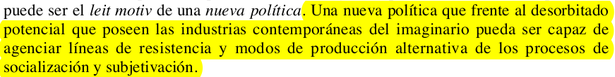

Empiezo las clases con entusiasmo, incluso en modo virtual rompen un poco con el [círculo vicioso](https://i.postimg.cc/jq4tNHHJ/Ei-DVRq-Uc-AA17s4.jpg) y me saca de la realidad sensible constante del covid.

Me gusta mucho el texto de Brea, aunque también tengo que leerlo [tres veces](https://i.postimg.cc/NjScYpcZ/Ej5w2-UXWs-AAam5x.jpg) para que no se me escape nada. Tiene varios planteos que resuenan con ideas que tengo, pero también me hace pensar en lo que implica desarrollar una práctica artística, dejar de pensar tanto en qué arte voy a hacer o qué tipo de artista voy a ser, y pensar más en términos de una producción dentro una práctica artística propia, con todo lo que eso implica. También enmarca esto dentro del rol que tiene el arte en la sociedad y la vida política.

