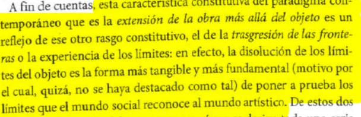

Julio no se perfila como un buen mes. De hecho creo que fue el peor de todos. Varios días trabajo hasta las 7-8-9 y cuando no es el caso me quedo hasta esa hora o más tarde trabajando en entregas para la facu.

Desde que tuve acceso a una compu propia e internet paso varias horas por día frente a ella, pero esta es la primera vez que siento que la odio.

.
.
.
Hasta que llega el primer encuentro sincrónico de la materia y me vuelvo a recargar. Es bueno escuchar las voces de les docentes y les compañeres, me devuelve el entusiasmo que tuve durante la semana de orientación. Vuelvo a los textos.

