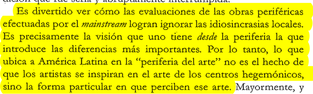
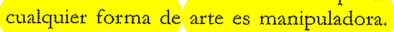

Agosto es el mes a puro leer textos. Estoy atrasada y ya sabemos que se viene el primer parcial.

Los textos de Camnitzer me gustan porque aportan un poco de perspectiva latinoamericana, pero también porque menciona el contenido político y eso de que todo arte es manipulador, o al menos que todo arte va a comunicar algo, que va a haber un contenido didáctico. No sé por qué durante el desarrollo teórico (si le puedo decir así) de la obra para el segundo parcial no lo menciono, pero es una de mis dudas más frecuente, quiero que mis obras se reconozcan como políticas y quiero que haya algo didáctico... el tema es cómo no caer en esa didáctica que puede ser recibida desde una postura esnobista de que el arte no es para enseñar nada, ni activar nada, el arte por el arte.

Me doy cuenta también que los textos que más me gustan son los que lidian con estos temas: [la dimensión política](https://i.postimg.cc/4ysGqygd/Ed-KMC-TXo-AIh7-MQ.jpg), [la posibilidad de activar a les participantes](https://i.postimg.cc/ydzC3xWP/photo-2020-01-29-16-57-30.jpg), etc.

