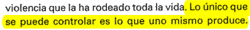

En octubre empiezo a pensar en la obra que hay que hacer para el segundo parcial. Tengo varias imágenes en la cabeza por un lado, y [sentimientos](https://i.postimg.cc/65HKbB1W/EUpfe-Fp-Wo-AEYq6-Z.jpg) [intensos](https://i.postimg.cc/fTg4jBJk/Screenshot-2020-09-24-Tweets-m-s-recientes-Twitter.png) por otro que no sé bien cómo articular.

Hago las cosas casi como el meme de la nena queriendo leer teoría. En teoría la idea me gusta, pero sentarme a codear es un parto.
[Al principio me gusta, ver las frases que genera, pero me la paso todo el tiempo pensando en que es demasiado obvio. Igual no encuentro forma de solucionarlo ahora.](https://i.postimg.cc/d15MzRmx/Captura-de-pantalla-de-2020-11-15-00-09-05.png)

Muchas veces tengo ganas de estar en otra, [más libre](https://www.youtube.com/watch?v=H7LpEMqMtCw).

